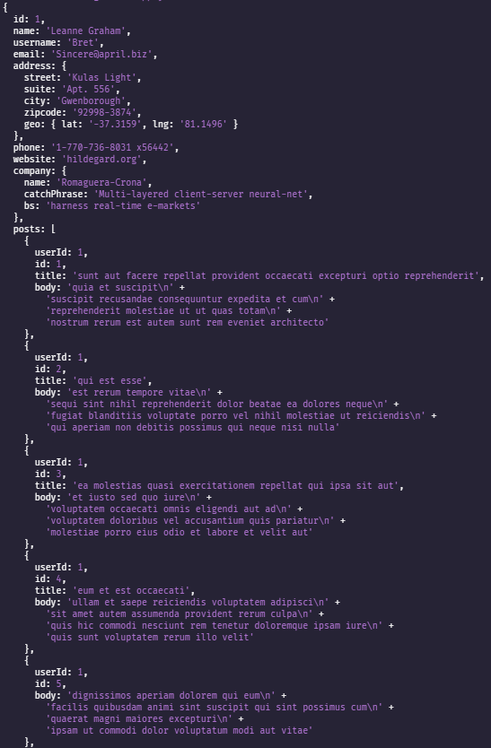

# Assignment 1

Get user and posts datas from Fake Data API with using axios and async functions.

<br>


#

<br>



<br>

#

<br>

## Project setup

```
npm install
```

### Start!

```
npm run watch or npm run start
```
